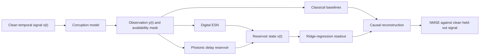

# RC Photonics

RC Photonics is a reproducible research project that investigates whether
reservoir computing—especially a simulated photonic delay reservoir—can repair
noisy or missing time-series data in real time.

The project compares six kinds of approaches under one causal experimental
protocol:

1. No processing
2. Classical moving-average and median filters
3. Linear regression using the current sample
4. Autoregression using recent samples
5. A digital echo-state network (ESN)
6. A simulated time-multiplexed photonic delay reservoir

The result is both a working signal-restoration package and an experimental
framework for discovering where photonic reservoir computing helps, where it
fails, and which simulated hardware imperfections matter most.

> **Current conclusion:** the digital ESN is effective for Gaussian and
> impulse-noise restoration. The V1 photonic reservoir can denoise signals, but
> it is not yet competitive with the ESN and loses useful memory during long
> missing intervals. The project reports that limitation directly rather than
> assuming the photonic model must win.

## Table of contents

- [The project in plain language](#the-project-in-plain-language)
- [The problem](#the-problem)
- [Why reservoir computing](#why-reservoir-computing)
- [Why photonic computing](#why-photonic-computing)
- [End-to-end system](#end-to-end-system)
- [The science and mathematics](#the-science-and-mathematics)
- [Experimental design](#experimental-design)
- [Final results](#final-results)
- [Photonic robustness](#photonic-robustness)
- [Real sensor experiment](#real-sensor-experiment)
- [Installation](#installation)
- [Running the project](#running-the-project)
- [Repository structure](#repository-structure)
- [Testing and reproducibility](#testing-and-reproducibility)
- [Limitations and next steps](#limitations-and-next-steps)

## The project in plain language

Imagine listening to a person over a bad phone connection. Even if part of a
word is distorted or briefly disappears, you can often infer what was said
from the recent conversation. You are not recovering the missing sound from
nothing; you are using temporal context.

This project applies the same general idea to numerical signals. A reservoir
maintains a changing internal state that acts like short-term computational
memory. When the current sensor reading is unreliable, a trained output layer
uses that state to estimate the clean reading.

The cognitive-science connection is conceptual rather than biological:
recurrent activity can preserve context after the original input has passed.
The reservoir is not intended to be a realistic model of the brain.

## The problem

Time-dependent measurements can be damaged by:

- random electronic or optical noise;
- sudden impulse spikes;
- missing packets or sensor dropouts;
- loss and drift in analog hardware;
- timing errors; and
- limited measurement precision.

A memoryless model sees only the current sample. If that sample is corrupted,
the model has little evidence from which to reconstruct it. A temporal model
can also use how the signal was behaving immediately beforehand.

The project enforces the causal rule

```text
estimate at time t = f(observations at times 0 through t)
```

No method is allowed to use future samples. This makes the task consistent
with a live processor rather than an offline smoother that can look ahead.

## Why reservoir computing

Reservoir computing is a form of recurrent machine learning in which the
internal recurrent system remains fixed. Input data drives the reservoir into
a high-dimensional sequence of states, and only a simple output layer is
trained.

This provides three useful properties:

- **Temporal memory:** the current state depends on earlier inputs.
- **Nonlinear representation:** complicated temporal relationships can become
  linearly readable in the state space.
- **Simple training:** the recurrent connections do not require
  backpropagation; only a ridge-regression readout is fitted.

The project includes a conventional digital ESN first. It provides a known
reservoir-computing reference before introducing photonic dynamics.

## Why photonic computing

Photonic processors use light-based physical dynamics for computation. They
can offer high bandwidth and parallelism, but real optical systems are analog
and subject to noise, loss, drift, quantization, and timing error.

A delay reservoir is attractive because one nonlinear optical element and a
feedback loop can emulate many recurrent units. The element is sampled at
different points during each delay period; those samples act as
**time-multiplexed virtual nodes**.

Rather than training every optical connection, the fixed physical dynamics
become the reservoir and only the final readout is learned. This project tests
that concept in software before any expensive hardware implementation.

The simulator is physically motivated, not device-level. It does not solve
Maxwell's equations or claim to reproduce a particular laboratory device.

## End-to-end system



The complete workflow is:

1. Generate a clean nonlinear Mackey–Glass trajectory or load real sensor
   data.
2. Preserve time order and create training, validation, and test partitions.
3. Add Gaussian noise, impulse corruption, or missing intervals.
4. Represent every sample as `[observed value, availability mask]`.
5. Send the two-channel input through the ESN or photonic reservoir.
6. Discard initial reservoir states while the dynamics settle.
7. Fit a regularized linear readout using only training states.
8. Select the reservoir and regularization value using validation data.
9. Evaluate the selected system once on held-out test data.
10. Compare it against classical baselines using the same causal information.

## The science and mathematics

### Mackey–Glass signal

The main synthetic benchmark uses the nonlinear delay equation

```text
dx/dt = β x(t - τ) / (1 + x(t - τ)^n) - γx(t)
```

with `β = 0.2`, `γ = 0.1`, `τ = 17`, `n = 10`, and integration step
`dt = 0.1`. The signal is deterministic but nonlinear and chaotic, making it
more informative than a simple periodic wave.

The first 1,000 generated samples are discarded to remove initialization
transients. The benchmark then uses 6,000 samples.

### Corruption models

Gaussian denoising uses

```text
y(t) = s(t) + ε(t),    ε ~ Normal(0, σ²)
```

Impulse experiments replace a seeded percentage of observations with strong
outliers. Missing-interval experiments remove contiguous blocks and set their
availability mask to zero.

### Digital echo-state network

The ESN performs a leaky recurrent update:

```text
candidate(t) = tanh(W_in u(t) + W x(t-1) + b)
x(t) = (1 - leak) x(t-1) + leak candidate(t)
```

The input and recurrent matrices are seeded and fixed. The recurrent matrix is
scaled to a selected spectral radius, which influences how strongly old
activity persists. The leak rate controls how quickly the state responds to
new inputs.

The fixed search contains four 50- or 100-node ESN candidates. Most synthetic
experiments selected the 100-node configuration with spectral radius `0.95`,
leak rate `0.2`, and input scaling `0.5`.

### Photonic delay reservoir

The photonic model applies a deterministic input mask, delayed feedback, leaky
virtual-node coupling, and the nonlinear response

```text
state = sin²(feedback + masked input + phase bias)
```

The `sin²` response approximates the intensity transfer behavior of a
Mach–Zehnder-style modulator. Previous round-trip states provide delayed
feedback, while sequential samples of the loop behave as 50 or 100 virtual
nodes.

### Shared ridge readout

Both reservoirs use the same output model:

```text
prediction = Xw + b
```

The trained parameters minimize

```text
||Xw + b - target||² + λ||w||²
```

Only `w` and `b` are trained. The penalty `λ` discourages unstable, excessively
large weights. The tested values are `1e-6`, `1e-3`, and `0.1`.

### Evaluation metric

The primary metric is normalized mean squared error:

```text
NMSE = mean((target - prediction)²) / variance(clean reference)
```

- `0` is perfect reconstruction.
- Lower is better.
- A value around `1` is comparable to always predicting the reference mean.
- A value greater than `1` is worse than that mean predictor.

For gaps, the error numerator uses only missing samples, while normalization
uses the variance of the complete clean split. This keeps scores comparable
across gap lengths.

## Experimental design

The 6,000-sample synthetic trajectory is split chronologically:

| Partition | Percentage | Samples | Purpose |
| --- | ---: | ---: | --- |
| Training | 60% | 3,600 | Fit readout parameters |
| Validation | 20% | 1,200 | Select reservoir and penalty |
| Test | 20% | 1,200 | Final held-out score |

The first 200 reservoir states of each partition are excluded as state
washout. Independent deterministic corruption seeds are used for each
partition.

The controls include identity processing, moving averages, a causal median
filter, last observation carried forward, current-sample regression, and
lagged autoregression. These controls prevent a complex model from receiving
credit for a task that a simple method solves better.

## Final results

### Gaussian denoising

| Noise σ | Identity | Moving average | Autoregression | ESN | Photonic |
| ---: | ---: | ---: | ---: | ---: | ---: |
| 0.02 | 0.006865 | 0.002000 | 0.000926 | **0.000707** | 0.001739 |
| 0.05 | 0.042066 | 0.006883 | 0.004813 | **0.004446** | 0.006861 |
| 0.10 | 0.174032 | 0.024403 | 0.014334 | **0.011720** | 0.025178 |
| 0.20 | 0.706382 | 0.058996 | 0.037812 | **0.032127** | 0.092020 |

The ESN beat autoregression at all four noise levels. It reduced NMSE by
approximately 7.6–23.7% relative to autoregression and by as much as 95.5%
relative to the unprocessed noisy signal.

The photonic model removed substantial noise but did not beat the ESN or
autoregression.

### Impulse denoising

| Impulse probability | Identity | Causal median | Autoregression | ESN | Photonic |
| ---: | ---: | ---: | ---: | ---: | ---: |
| 0.01 | 0.049598 | **0.000200** | 0.005497 | 0.000392 | 0.002568 |
| 0.05 | 0.216426 | 0.003247 | 0.021599 | **0.001666** | 0.010880 |
| 0.10 | 0.459906 | **0.003374** | 0.028333 | 0.006162 | 0.049374 |
| 0.20 | 0.955882 | 0.026402 | 0.044492 | **0.025083** | 0.106150 |

The ESN reduced NMSE relative to autoregression by 92.9%, 92.3%, 78.0%, and
43.2% as impulse probability increased. The causal median filter remained the
best specialized method at three of the four settings.

### Missing intervals

| Gap samples | Carried forward | Autoregression | ESN | Photonic |
| ---: | ---: | ---: | ---: | ---: |
| 5 | 0.002935 | **<0.000001** | 0.002461 | 0.259413 |
| 10 | 0.009604 | **<0.000001** | 0.012945 | 1.699307 |
| 20 | 0.030931 | **0.000005** | 0.055112 | 1.684836 |
| 40 | 0.081846 | **0.000157** | 0.238981 | 1.552219 |
| 80 | 0.211857 | **0.019200** | 0.542724 | 1.294124 |

Autoregression dominated the gap task because the deterministic Mackey–Glass
trajectory is highly locally predictable. The ESN degraded as gaps grew. The
photonic reservoir lost its informative autonomous state and exceeded NMSE
`1` for most longer gaps.

This negative result is valuable: improving autonomous memory is the clearest
next research direction for the photonic architecture.

## Photonic robustness

The readout is trained once on ideal photonic dynamics, then reused without
retraining under each simulated impairment. This prevents retraining from
hiding hardware degradation.

| Simulated condition | Test NMSE |
| --- | ---: |
| Ideal | 0.037850 |
| Internal noise 0.005 | 0.094037 |
| Internal noise 0.02 | 0.874763 |
| Feedback attenuation 0.1 | 0.121102 |
| Feedback attenuation 0.4 | 1.611486 |
| Quantization 8 bit | 0.041055 |
| Quantization 4 bit | 0.836562 |
| Drift 0.01 | 0.058765 |
| Timing jitter 0.01 | 0.317880 |

Eight-bit quantization stayed within approximately 8.5% of ideal NMSE. Strong
attenuation, internal noise, four-bit quantization, and timing jitter caused
major degradation. These values are dimensionless simulation settings and are
not calibrated laboratory units.

## Real sensor experiment

The real-data workflow uses the UCI Air Quality dataset and its
`PT08.S1(CO)` metal-oxide sensor response.

Preprocessing:

- treats `-200` as UCI's missing-data marker;
- selects the longest contiguous valid hourly sequence;
- retains 1,778 samples;
- uses a chronological 60/20/20 split; and
- standardizes all partitions using training statistics only.

With Gaussian corruption standard deviation `0.1`:

| Model | Corrupted identity NMSE | Restored NMSE |
| --- | ---: | ---: |
| ESN | 0.016038 | **0.014949** |
| Photonic | 0.016038 | 0.022058 |

The ESN improved NMSE by approximately 6.8%. The V1 photonic model increased
error on this dataset, indicating weaker generalization.

## Installation

Python 3.11 or 3.12 is recommended. NumPy is the only runtime dependency.

### Windows PowerShell

```powershell
git clone https://github.com/Dev-Sinha13/RC-resolver-for-photonic-processor.git
cd RC-resolver-for-photonic-processor
python -m venv .venv
.\.venv\Scripts\python.exe -m pip install -e .
.\.venv\Scripts\python.exe -m unittest discover -s tests -v
```

### macOS or Linux

```bash
git clone https://github.com/Dev-Sinha13/RC-resolver-for-photonic-processor.git
cd RC-resolver-for-photonic-processor
python3 -m venv .venv
.venv/bin/python -m pip install -e .
.venv/bin/python -m unittest discover -s tests -v
```

## Running the project

After installation, run:

| Command | Purpose | Expected runtime |
| --- | --- | --- |
| `rc-photonics-baselines` | Classical Gaussian and gap baselines | Seconds |
| `rc-photonics-esn` | Full ESN Gaussian, impulse, and gap benchmark | Seconds |
| `rc-photonics-photonic` | Full photonic benchmark | Several minutes |
| `rc-photonics-robustness` | Photonic impairment comparison | Seconds |
| `rc-photonics-sensor` | Download and test UCI sensor data | Seconds |
| `rc-photonics-figures` | Recompute all results and write CSV/SVG files | Several minutes |

On Windows, the commands are located under `.venv\Scripts\` and may have an
`.exe` suffix. Equivalent source-checkout wrappers are available in
[`scripts/`](scripts/).

The sensor command downloads the official dataset into `data/raw/` when no
`--path` is provided:

```powershell
.\.venv\Scripts\rc-photonics-sensor.exe
```

To use an existing file or another included sensor column:

```powershell
.\.venv\Scripts\rc-photonics-sensor.exe `
  --path data\raw\AirQualityUCI.csv `
  --column "PT08.S2(NMHC)"
```

Generated raw data and `results/` outputs are intentionally ignored by Git.

## Repository structure

```text
RC-resolver-for-photonic-processor/
├── configs/                        fixed model and robustness parameters
├── data/README.md                  real-dataset provenance and preprocessing
├── docs/
│   ├── experimental_protocol.md    frozen scientific evaluation rules
│   ├── implementation_roadmap.md   completed architecture and extensions
│   ├── references.md               primary literature and dataset references
│   └── results.md                  complete deterministic V1 result tables
├── scripts/                        source-checkout experiment wrappers
├── src/rc_photonics/
│   ├── signals.py                  Mackey–Glass generation
│   ├── corruption.py               noise, impulses, gaps, and masks
│   ├── datasets.py                 chronological splitting
│   ├── metrics.py                  MSE and NMSE
│   ├── baselines.py                causal classical baselines
│   ├── autoregression.py           linear temporal baselines
│   ├── readout.py                  shared ridge output layer
│   ├── esn.py                      digital echo-state network
│   ├── photonic_delay.py           virtual-node delay reservoir
│   ├── hardware.py                 simulated non-idealities
│   ├── model_evaluation.py         training, selection, and evaluation
│   ├── sensor_data.py              UCI loading and preprocessing
│   ├── reporting.py                Markdown, CSV, confidence intervals, SVG
│   └── reservoir_cli.py            executable workflows
└── tests/                           74 deterministic unit tests
```

## Testing and reproducibility

Run all tests with:

```powershell
.\.venv\Scripts\python.exe -m unittest discover -s tests -v
```

The 74-test suite checks:

- deterministic seeded behavior;
- causal behavior under changed future inputs;
- exact metric calculations;
- chronological partitioning;
- input validation and non-mutation;
- ESN spectral-radius scaling and reset behavior;
- photonic state bounds and virtual-node behavior;
- zero-impairment equivalence;
- hardware impairment reproducibility;
- validation-driven model selection;
- real sensor parsing and training-only normalization; and
- CSV/SVG reporting.

GitHub Actions performs editable installation, the full unit suite, the
baseline command, and reservoir API import checks on Python 3.11 and 3.12.

All checked-in benchmark values are deterministic single-seed results. The
reporting module supports confidence intervals, but publication-grade claims
should use repeated independent reservoir and corruption seeds.

## Limitations and next steps

V1 is a complete software research prototype, not a finished physical
photonic processor. Important limitations are:

- The photonic model is phenomenological rather than device calibrated.
- The benchmark tables report deterministic single-seed runs.
- Mackey–Glass strongly favors autoregression during missing intervals.
- Only one real sensor sequence has been evaluated.
- Hardware impairment settings are not expressed in measured device units.
- The delay reservoir does not yet maintain a useful autonomous trajectory
  through long missing gaps.

The most valuable next experiments are:

1. Measure linear and nonlinear memory capacity directly.
2. Repeat complete benchmarks across multiple initialization seeds.
3. Train the photonic system explicitly for stable closed-loop operation.
4. Search delay, feedback, phase-bias, and mask designs more broadly.
5. Calibrate impairments against a specific modulator, detector, and delay
   line.
6. Evaluate additional real sensor and communication datasets.
7. Compare accuracy, latency, and energy with actual photonic hardware.

## Documentation and references

- [Complete result tables](docs/results.md)
- [Experimental protocol](docs/experimental_protocol.md)
- [Architecture and research extensions](docs/implementation_roadmap.md)
- [Scientific references](docs/references.md)
- [Dataset provenance](data/README.md)

The architecture is motivated by echo-state networks and single-node
time-multiplexed delay reservoirs. The reference list includes Jaeger and Haas,
Appeltant et al., Paquot et al., echo-state-property analysis, and the official
UCI Air Quality dataset citation.

## Project status

The implementation is version `0.2.0`. The complete V1 research prototype,
tests, configurations, scripts, results, and documentation are present in this
repository.
